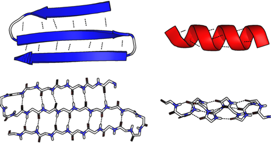

# An Introduction to Transformers in Biology

**Problem:**
Given an amino acid sequence, find a way to reliably predict the corresponding secondary structure sequence. 

**Biological Relevance**

Let's begin this discussion with the understanding that amino acids are the building blocks of proteins. One of the most fundamental laws of biology is that structure determines function. At the molecular and cellular level, the structure of proteins dictates their capabilities. Let's take hemoglobin for example. Hemoglobin is an oxygen distributing protein complex that is essential to human life. Hemoglobin's ability to distribute oxygen is thanks to its structure. Its structure is a consequence of the arrangement of amino acids that were used to build the protein. In this project we are zooming into protein structure and looking at what biologists call the secondary structure. Secondary structures are constructed with regards to how local amino acids interact with each other. A few examples include helical, coil, and sheet like structures. Together these secondary structures come together to build increasing levels of protein structure that eventually lead to the construction of the whole protein.

**Why Transformers?**

This problem requires us to understand the intricate relationships between individual amino acid residues and how they impact secondary structure. We are looking for a pattern within the residues that gives us an improved chance of predicting the secondary structure. A piece of software that can comprehend patterns and use that understanding to make predictions suits this task perfectly. Thankfully, neural networks excel at tasks like this. A typical software program gives the computer a finite set of instructions to meet a goal. To predict the behavior of complex systems like protein folding it is more efficient to use a neural network which has the flexibility of understanding systems with many variables.

**What are Transformers?**

In recent years there have been modifications and improvements upon the neural network architecture. One such model is the transformer. I am positive most of you are now aware of the many transformers use cases, most notably, ChatGPT. For now let’s think of the transformer as a black box for which we input some information and it outputs a prediction using our input. We will go further into the workings of the transformer later on. I have also linked some extracurricular resources at the bottom. 

**How Will We Use Transformers**

In order for transformers to make valid predictions, they need to be trained on extensive datasets. Hence the ever expanding network of data centers as of recent. In our case, we will need a large dataset of varying residue sequences and their corresponding secondary structures. Training on such a dataset, will familiarize the transformer with various biological patterns. For example, the transformers will notice a specific string of residues tends to lead to a helical structure. Using that information it will adjust itself and apply that knowledge in the future. The more data we allow the transformer to be trained on the better it should perform.

**Finding Our Dataset**

When it comes to finding the right dataset we have two options. We can either create our own dataset using resources like the Protein Data Bank, an extensive library of all things protein, or we can download a curated one from Kaggle. Let's briefly go through how you would do each one.  

To create a dataset using the Protein Data Bank (PDB) you will need to be mildly familiar with using python. If you are not comfortable doing so you can try using ChatGPT or other AI software to generate the information retrieval code for you. Disclaimer: code generated by AI can often harbor critical errors. While generating the code won’t be too complicated, debugging errors will require more technical expertise. The best thing you can do is learn what the generated code is actually executing so that you can debug errors when they appear. ChatGPT can give you templates of code but, it will be up to you to ensure that it completes the correct tasks. Those wanting to use the curated Kaggle dataset may skip the next section.

To create our own dataset there are two tools we will need to use. The first is the Protein Data Bank. This library houses all information related to any protein that has been discovered. The PDB labels all of its proteins with a four character identification tag called the PDB ID. The first step will be retrieving a list of PDB IDs that match the protein sequences we would like to have in our dataset. Some restrictions you may want to have in your dataset are: sequence length greater than 50 and less than 500, resolution requirements, and experimental method. Having a narrower range of sequences will better allow the transformer to pick up on patterns because the dataset is more normalized. A higher resolution and the experimental method used in discovery will ensure that the data retrieved is accurate. Next you will need to use this list of PDB IDs to retrieve the amino acid sequences. ChatGPT can generate a retrieval code or query that should return the list of PDB IDs along with their corresponding  sequences. Finally you will need to deploy the Define Secondary Structures of Protein (DSSP) algorithm to retrieve the secondary structures. DSSP uses the PDB ID given and parses through the protein's PDB file to construct a secondary structure sequence based on the protein’s 3D atomic coordinates. This should return a sequence that represents the protein’s secondary structure and that is the same length as the amino acid sequence. Each residue in the sequence is assigned a secondary structure indicator meaning a one to one correspondence is necessary. 

The second dataset option is using a curated one off Kaggle. Here is the dataset we are going to use as the standard in our project: Protein-Secondary-Structure. From here you will need to download the file and edit the file so that the data frame only contains the columns concerning amino acid sequences and secondary structure sequences.

**Opening Up The Transformer**

The transformer is a next generation pattern predictor. In order for it to construct an understanding of the patterns, it needs to look at the whole sequence. You can’t look at one section and expect to pick up patterns. Transformers use a mechanism called ‘self-attention’ which allows them to observe all residues in a sequence at once. By constructing a full picture it can better define the context of each individual residue with respect to its surroundings. In a sequence like ABC, the C will provide a different context from a contrasting sequence like DEC. In biological terms, even though C is in the same position, its surrounding residues are different resulting in a different secondary structure sequence. Self-attention uses a full scope when trying to decipher how a single residue impacts secondary structure. 

**Feeding The Transformer**

Transformers require our inputs to be in a specific format in order to perform operations like self-attention. To understand the best format for our data, it is important to remember that all transformer operations are complex mathematical functions. Previously we have imagined that the transformer is fed an alphabetical sequence that represents amino acids and outputs a different alphabetical sequence that represents secondary structure. During training the transformer makes an initial prediction. The difference between its prediction and the expected value is called ‘loss’. Given enough repetitions in training, the transformer will minimize the loss and the difference between the prediction and the expected value will be negligible. In our imagination we can visualize the difference being the number of residues in the sequence wrongly labeled. In actuality, there is a real number that represents the loss. So how do we transform our alphabetical sequences into a format that allows the transformer to perform operations like self-attention and loss?

We prepare our data by mapping each possible character in our amino acid vocabulary to a number. There are 20 different amino acids that are commonly found in proteins. That means our vocabulary includes 20 unique characters, each representing an amino acid and each mapped to a unique number. Now our sequences are in a numerical format that programs can understand. In order for our transformer to understand and operate on them there is one last step called embedding. We map each number to a unique set of numbers (matrix). Remember how I said that self-attention is able to determine the context of a single residue with respect to its surroundings. It is able to represent that context by changing the numbers in that residue’s matrix. That means that the more numbers in the matrix the more detailed a residue’s context can be. Thinking of it like the resolution of a picture. The more pixels (higher resolution) means increased detail. This increase in the detail of the residue’s context is the entire reason why we represent each amino acid with a group of numbers instead of just one.

Let’s review the process. We take our sequence of letters, convert them into single/unique numbers, and then map these numbers to matrices. This process is done for the amino acid alphabet as well as the secondary structure alphabet.

