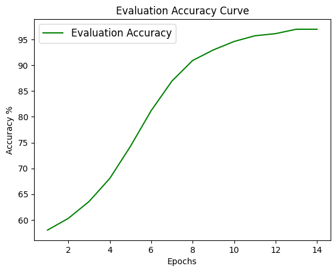
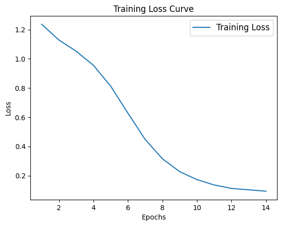

# An Introduction to Transformers in Biology

**Problem:**
Given an amino acid sequence, find a reliable way to predict the corresponding secondary structure sequence. 

**Project Overview:**
This project leverages the capabilities of the transformer model to predict the secondary structure of proteins given and amino acid sequence. The model uses an 8 class labeling system to assign each residue a secondary structure.

**Results:**
- Model: ProtBERT (Rostlab/prot_bert)
- Task: Protein secondary structure prediction
- Dataset: Curated protein sequence/secondary-structure dataset
- Classification: 8 secondary structure classes
- Evaluation accuracy: 97%
- Training: 14 epochs using PyTorch and AdamW

**Biological Relevance**

Let's begin with the understanding that amino acids are the building blocks of proteins. The order in which the amino acids are linked together influences the protein's final structure. Structure then dictates the proteins capabilities. Hemoglobin for example, is an oxygen distributing protein complex essential to life. Hemoglobin is only able to carry and distribute oxygen due to its structure. Its structure is a consequence of the arrangement of amino acids that were used to build the protein. In this project we are looking at what biologists call the secondary structure. Secondary structures are constructed with regards to how local amino acids interact with each other. A few examples include helical, coil, and sheet like structures. Together these secondary structures come together to build increasing levels of protein structure that eventually lead to the construction of the whole protein.


**Why Transformers?**

This problem requires us to understand the intricate relationships between individual amino acid residues and how they impact secondary structure. We are looking for patterns within a protein's amino acid sequence that gives us an improved chance of predicting the secondary structure. Thankfully, neural networks excel at tasks like this. A typical software program gives the computer a finite set of instructions. The greater variablility within the system, the harder it becomes to write a fitting program. To predict the behavior of complex systems like protein folding it is more efficient to use a neural network which has the flexibility of understanding systems with many variables.

**What are Transformers?**

In recent years there have been modifications and improvements upon the neural network architecture. The newest and most popular iteration is called the transformer. Most notablely it is the backbone of ChatGPT. For now think of the transformer as a machine that takes in information, finds patterns to understand the information, and lastly utilize the information to make a prediction.

**How Will We Use Transformers**

In order for transformers to pick up patterns and make valid predictions, they need to see many differnet pieces of information. In our case they need to look at a vast dataset of differing sequences to learn the patterns common between them all. We need a large dataset of varying residue sequences and their corresponding secondary structures. Training on such a dataset, will familiarize the transformer with various biological patterns. For example, the transformers will notice a specific string of residues tends to lead to a helical structure. Using that information it will adjust itself and apply that knowledge to make an improved prediction. The more data we allow the transformer to be trained on the better it should perform.

**Opening Up The Transformer**

The transformer needs to look at the full scope of a sequence to pick up a pattern. It's difficult to find a pattern when your scope is only a few residues wide. Transformers use a mechanism called ‘self-attention’ which allows them to observe all residues in a sequence at once. By constructing a full picture they can better define the context of each individual residue with respect to its surroundings. In a sequence like ABC, the C will provide a different context from a contrasting sequence like DEC. In biological terms, even though C is in the same position, its surrounding residues are different resulting in a different secondary structure sequence. Self-attention uses a full scope when trying to decipher how a single residue impacts secondary structure. 

**Finding Our Dataset**

When it comes to finding the right dataset we have two options. We can either create our own dataset using resources like the Protein Data Bank, an extensive library of all things protein, or we can download a curated one from Kaggle. Kaggle is a data science website that allows users to share datasets, competeing in machine learning competitions, and share projects.

To create a dataset using the Protein Data Bank (PDB) you will need to be mildly familiar with using python. If you are not comfortable doing so you can try using ChatGPT or other AI software to generate the information retrieval code for you. Disclaimer: code generated by AI can often harbor critical errors. While generating the code won’t be too complicated, debugging errors will require more technical expertise. The best thing you can do is learn what the generated code is actually executing so that you can debug errors when they appear. ChatGPT can give you templates of code but, it will be up to you to ensure that it completes the correct tasks. Those wanting to use the curated Kaggle dataset may skip the next section.

To create our own dataset there are two tools we will need to use. The first is the Protein Data Bank. This library houses all information related to any protein that has been discovered. The PDB labels all of its proteins with a four character identification tag called the PDB ID. The first step will be retrieving a list of PDB IDs that match the protein sequences we would like to have in our dataset. Some restrictions you may want to have in your dataset are: sequence length greater than 50 and less than 500, resolution requirements, and experimental method. Having a narrower range of sequences will better allow the transformer to pick up on patterns because the dataset is more normalized. A higher resolution and the experimental method used in discovery will ensure that the data retrieved is accurate. Next you will need to use this list of PDB IDs to retrieve the amino acid sequences. ChatGPT can generate a retrieval code or query that should return the list of PDB IDs along with their corresponding  sequences. Finally you will need to deploy the Define Secondary Structures of Protein (DSSP) algorithm to retrieve the secondary structures. DSSP uses the PDB ID given and parses through the protein's PDB file to construct a secondary structure sequence based on the protein’s 3D atomic coordinates. This should return a sequence that represents the protein’s secondary structure and that is the same length as the amino acid sequence. Each residue in the sequence is assigned a secondary structure indicator meaning a one to one correspondence is necessary. 

The second dataset option is using a curated one off Kaggle. Here is the dataset we are going to use as the standard in our project: Protein-Secondary-Structure. From here you will need to download the file and edit the file so that the data frame only contains the columns concerning amino acid sequences and secondary structure sequences.

**Feeding The Transformer**

Transformers require our inputs to be in a specific format in order to perform operations like self-attention. To understand the best format for our data, it is important to remember that all transformer operations are complex mathematical functions. Previously we have imagined that the transformer is fed an alphabetical sequence that represents amino acids and outputs a different alphabetical sequence that represents secondary structure. During training the transformer makes an initial prediction. The difference between its prediction and the expected value is called ‘loss’. Given enough repetitions in training, the transformer will minimize the loss and the difference between the prediction and the expected value will be negligible. In our imagination we can visualize the difference being the number of residues in the sequence wrongly labeled. In actuality, there is a real number that represents the loss. So how do we transform our alphabetical sequences into a format that allows the transformer to perform operations like self-attention and loss?

We prepare our data by mapping each possible character in our amino acid vocabulary to a number. There are 20 different amino acids that are commonly found in proteins. That means our vocabulary includes 20 unique characters, each representing an amino acid and each mapped to a unique number. Now our sequences are in a numerical format that programs can understand. In order for our transformer to understand and operate on them there is one last step called embedding. We map each number to a unique group of numbers. Remember how I said self-attention is able to determine the context of a single residue with respect to its surroundings. It is able to represent that context by changing the numbers in that residue’s group. That means that the more numbers in the group the more detailed a residue’s context can be. Think of the group of numbers like the resolution of a picture. The more pixels (higher resolution) means increased detail. This increase in the detail of the residue’s context is the entire reason why we represent each amino acid with a group of numbers instead of just one.

Review: take our sequence of letters, convert them into single/unique numbers, and then map these numbers to matrices. This process is done for the amino acid alphabet as well as the secondary structure alphabet. The following cells wil display how to process our data before training and evaluating the model. The process of mapping a character to a number is called tokenization and the mapping of the number to a group of numbers is called embedding. 


**Application**

When it comes time to use the transformer we can do so by accessing python libraries like Hugging Face. Hugging Face is a library that contains a vast set of options when it comes to finding a specific model that meets your needs. We will access this library to import our transformer of choice. Another python library we will be accessing is PyTorch. Where Hugging Face provides us with models to use, PyTorch gives us the framework and tools we need to interact with the models.

**Preprocessing**

The first step is to import the dataset that we acquired through Kaggle. The orginal file contains a dataset with more columns than needed so we will be selecting and keeping the columbs containing the protein IDs, amino acid sequences, and corresponding secondary structure sequences.
```python
# Loading Kaggle SS file
import pandas as pd
from google.colab import drive

drive.mount('/content/drive')
file_path = '/content/drive/MyDrive/2018-06-06-pdb-intersect-pisces.csv.zip'
df = pd.read_csv(file_path)

#Filtering for 3 columns
new_df = df[['pdb_id','seq','sst8']]
new_df
```
The next cell filters our dataset so that it only contains sequences between 50-1000 residues. Limiting the variation in our dataset will make it easier for the transformer to handle the sequences.
```python
#Filtering for seq lengths inbetween 50-500
newer_df = new_df[new_df['seq'].str.len().between(51,999)]
newer_df
newer_df = newer_df.reset_index(drop = True)

#Saving to Drive
newer_df.to_parquet('/content/drive/MyDrive/kaggleDS')
```

**Tokenization**

The next step is tokenization or mapping our characters to numbers. To find all unique characters that may appear in our amino acid sequences, we concatenate all sequences and remove repeat characters. This leaves us with a list of characters representing our amino acid alphabet (or all characters that may appear in a sequence). From there we create a look up table that maps each letter in the alphabet to a unique number.
```python
#Loading curated Kaggle dataset
drive.mount('/content/drive')
file_path = '/content/drive/MyDrive/kaggleDS'
df = pd.read_parquet(file_path)

#Finding all unique letters in aa seq
unique_letters = set(''.join(df['seq'].to_list()))
unique_letters = '*ACDEFGHIKLMNPQRSTVWY'

#Creating dictionary to integer encode amino acids
character_to_indx = {character : indx for indx, character in enumerate(unique_letters)}
character_to_indx
```

There is one more token that we need to create. When we train transformers it is usually in batches of sequence (to speed up training process). This means we input multiple sequences at a time. In order for the transformer to work with batches, the sequences need to all be the same length. To achieve this we add a 'pad token' to the end of the shorter sequences to match the length of the longest sequence in the batch. The transformer knows that this is just a filler and will not take it into account.  
```python
#Creating a token just for padding
character_to_indx['<PAD>'] = len(character_to_indx)
pad_token = character_to_indx['<PAD>']
```

In this cell we are applying our tokenization maps to the dataset, turning our sequences of letters into sequences of numbers (ready for the transformer). When the transformer makes a secondary structure prediction, it does so by representing the structures with a list of numbers. These numbers represent the protein's secondary structures. From there it will use the difference between the expected and predicted numbers to improve itself. With that in mind, we need to represent the secondary structure sequences as numbers. This cell also includes the tokenization of the secondary structure sequences.
```python
#Applying encoder to sequences
df['encoded_aa_seqs'] = df['seq'].apply(lambda seq: [character_to_indx[character] for character in seq])

#Finding all unique chacters in ss seq
unique_characters = set(''.join(df['sst8'].to_list()))
unique_characters = 'BCEGHIST'

#Creating dictionary to encode secondary structures
letter_to_indx = {character: indx for indx, character in enumerate(unique_characters)}
letter_to_indx

#Applying dictionary to ss seqs
df['encoded_ss_seqs'] = df['sst8'].apply(lambda seq: [letter_to_indx[letter] for letter in seq])

#Saving changes to drive
new_df = df
new_df.to_parquet('/content/drive/MyDrive/kaggleDS')
```

**DataLoader**

Now that our dataset has been narrowed down and prepared for the transformer we need to discuss how to feed it in. As I mentioned before, PyTorch is a python library that provides us with the functions and tools we need to interact with and manipulate deep learning models. Pytorch has a tool called the DataLoader which enables us to easily feed the transformer. Imagine the dataset as a steak. Through tokenization we cooked and prepared it. DataLoader cuts the steak into pieces or batches, and feeds the transformer. 

While DataLoader is a useful and effecient tool it typically needs to be used on a dataset that has already be turned into a python class. By turning our dataset into a class, we are telling DataLoader exactly what to expect and how to effeciently handle our data. One attribute we give our class is dataset length which tells DataLoader how many sequences it will need to handle. 
```python
#Imports
import pandas as pd
from google.colab import drive
import torch
import torch.utils.data
from torch.utils.data import DataLoader, Dataset


#Dataset
drive.mount('/content/drive')
file_path = '/content/drive/MyDrive/kaggleDS'
df = pd.read_parquet(file_path)

class ProteinDataset(Dataset):# Create class for my dataset so it can be iterated over and retrieved by PyTorch's DataLoader
  def __init__(self, dataframe): #initialize my data
    self.data = df

  def __len__(self): # get number of values or sequences that way DataLoader knows what it is handling
    return len(self.data)

  def __getitem__(self, indx): # get each sequence
    aa = self.data.iloc[indx]['encoded_aa_seqs']
    ss = self.data.iloc[indx]['encoded_ss_seqs']

    aa_seq = torch.LongTensor(aa) # turn sequences into tensors
    ss_seq = torch.LongTensor(ss)

    return aa_seq, ss_seq
```

Another task that DataLoader handles for us is padding. When it turns our dataset into batches it will make sure each batch is symetrical by padding the shorter sequences with the pad token we created earlier. In this cell we are specifying how and what DataLoader should accomplish the padding with. We specify the padding tokens for the amino acid sequences and secondary sequences. 
```python
#Padding
from torch.nn.utils.rnn import pad_sequence

def collate_fn(batch):
  input_seqs = [item[0] for item in batch] #specify each seq in the batch
  input_labels= [item[1] for item in batch]

  padded_input_seqs = pad_sequence(input_seqs, batch_first=True, padding_value=pad_token)
  padded_input_labels = pad_sequence(input_labels, batch_first=True, padding_value=-100)

  return {'input_ids' : padded_input_seqs,
          'labels' : padded_input_labels}
```

**Training and Testing Data**

In practice we are actually going to use two DataLoaders. One for training and another for testing. When evaluating the efficacy of a transformer you want to test it on sequences that are different from the training data. While they are expected to have similar pattern, the transformer will not be testing on a sequence that it has already seen. This ensures that it has actually gained some understanding and can apply it. This is why we split our dataset into training and testing data. In this scenario we will split our dataset into 90 percent training and 10 percent testing. Lastly we will turn each dataset into indivdual classes and then apply the DataLoader upon them.
```python
#Split into training and testing data
from sklearn.model_selection import train_test_split

training_ds, testing_ds = train_test_split(df, test_size=0.1) #split dataset up

training_ds = ProteinDataset(training_ds) #run it thru the protein dataset class to ready it for dataloader
testing_ds = ProteinDataset(testing_ds)

training_loader = DataLoader(dataset=training_ds, batch_size=2, collate_fn=collate_fn, shuffle=True)
testing_loader = DataLoader(dataset=testing_ds, batch_size=2, collate_fn=collate_fn, shuffle=True)
```

The next step is importing our transformer of choice and writing the training loop. Later on we will go over why we chose this specific model. 
```python
#Loading model
from transformers import AutoModelForTokenClassification

model = AutoModelForTokenClassification.from_pretrained(
    "Rostlab/prot_bert",
    num_labels=len(unique_characters),
)
```

**Training Loop**

We are going to break down the training loop into four simple steps. Many deeplearning models, whether they be simple neural netowrks or transformer, will go through some form of this training loop. 
1. **Foward pass:** The training data is pushed throught the transformer and the transformer outputs a prediction based upon its initial settings.
2. **Calculating loss:** The transformer finds the differnece between the initial prediction and the expected output.
3. **Back propagation:** The loss is used to find which settings and how much the settings need to be adjusted so that the next output is closer to the expected value and the loss decreases.
4. **Gardient Descent:** These findings as applied to the transformer and it is now updated and ready for the next batch.
One training loop is finished once all the batches in our dataset have been run through the transformer at least once. After each epoch the transformer will be evaluated using the testing dataset we created before. As the number of epochs progresses, we should see the training loss decrease and the evaluation accuracy (or test score) increase. This will ensure us that the transformer is being able to learn using the dataset and making increasingly accurate predictions.
```python
#Training Loop

#Imports
import torch
from torch.optim import AdamW
from tqdm import tqdm
import os # Import the os module


#Setup
model = model #specifies model as our ProtBERT transformer
device = device #specifies the device we want to run our computation one
model.to(device) #putting our model on that device (GPU)
PATH = '/content/drive/MyDrive/ProtBERT_for_ss/checkpoint.pt'

# Optimizer
optimizer = AdamW(model.parameters(), lr=2e-5) #specifies the optimzer we want which will perform gradient descent

# Training Loop
def train(model, training_loader, testing_loader, optimizer, start_epoch=0, epochs = 3):
  model.train() #training mode enables dropout: randomly disables certain neurons to avoid overfitting

  # Create the directory if it doesn't exist
  os.makedirs(os.path.dirname(PATH), exist_ok=True)

  for epoch in range(start_epoch, start_epoch + epochs):
    total_training_loss = 0
    for batch in training_loader:
      input_ids = batch['input_ids'].to(device)
      labels = batch['labels'].to(device)

      #Create attention mask
      attention_mask = (input_ids != pad_token).to(device)

      outputs = model(input_ids=input_ids, labels=labels, attention_mask=attention_mask)
      loss = outputs.loss

      optimizer.zero_grad()
      loss.backward()
      optimizer.step()

      total_training_loss += loss.item()

    avg_training_loss = total_training_loss / len(training_loader)


    all_preds =[]
    all_labels = []

    model.eval()

    with torch.no_grad():
      total_loss = 0
      for batch in tqdm(testing_loader):
        input_ids = batch['input_ids'].to(device)
        labels = batch['labels'].to(device)
        attention_mask = (input_ids != pad_token).to(device)

        outputs = model(input_ids=input_ids, labels=labels, attention_mask=attention_mask) # Pass labels here
        predictions = torch.argmax(outputs.logits,dim = -1)
        loss = outputs.loss

        for pred, label in zip(predictions, labels):
            pred = pred.cpu().numpy()
            label = label.cpu().numpy()

            # Ignore padded positions (where label == -100)
            mask = label != -100
            all_preds.extend(pred[mask])
            all_labels.extend(label[mask])

        total_loss += loss.item()
    # Compute accuracy and loss
    correct = sum(p == l for p, l in zip(all_preds, all_labels))
    total = len(all_labels)
    acc = correct / total * 100
    avg_testing_loss = total_loss/len(testing_loader)

    #Save state_dict
    torch.save({
    'epoch': epoch,
    'model_state_dict': model.state_dict(),
    'optimizer_state_dict': optimizer.state_dict(),
    }, PATH)


    print(f"Evaluation Accuracy: {acc:.2f}% | Average training loss: {avg_training_loss} | Average testing loss: {avg_testing_loss}")

  model.train()
```

This final cell is where we tie everything together. Using the training loop function we defined, we insert our model, dataset, and the number of epochs we want to train for. Since I am running this through Google Colab and my runtime session is suceptible to interuptions, I am creating a checkpoint which saves the improved transformer settings up to that epoch. This allows me to resume training from that point, preventing me from having to start over. 
```python
from google.colab import drive
import os
import torch

#Mount Google Drive
drive.mount('/content/drive')

#Define Save Path
PATH = '/content/drive/MyDrive/ProtBERT_for_ss/checkpoint.pt'
os.makedirs(os.path.dirname(PATH), exist_ok=True)

#Load Checkpoint
start_epoch = 0
if os.path.exists(PATH):
    checkpoint = torch.load(PATH, map_location=device)
    model.load_state_dict(checkpoint['model_state_dict'])
    optimizer.load_state_dict(checkpoint['optimizer_state_dict'])
    start_epoch = checkpoint['epoch'] + 1
    print(f"Resuming training from epoch {start_epoch}")
else:
    print("No checkpoint found — starting from scratch.")

#Train Model
num_additional_epochs = 1
train(model,
      training_loader=training_loader,
      testing_loader=testing_loader,
      optimizer=optimizer,
      start_epoch=start_epoch,
      epochs=num_additional_epochs)
```

**Results**

After running the transformer for 14 epochs the evaluation accuracy plateued and the loss stopped decreasing. Our final evaluation accuracy was 97 percent and our final training loss was 0.093. 





