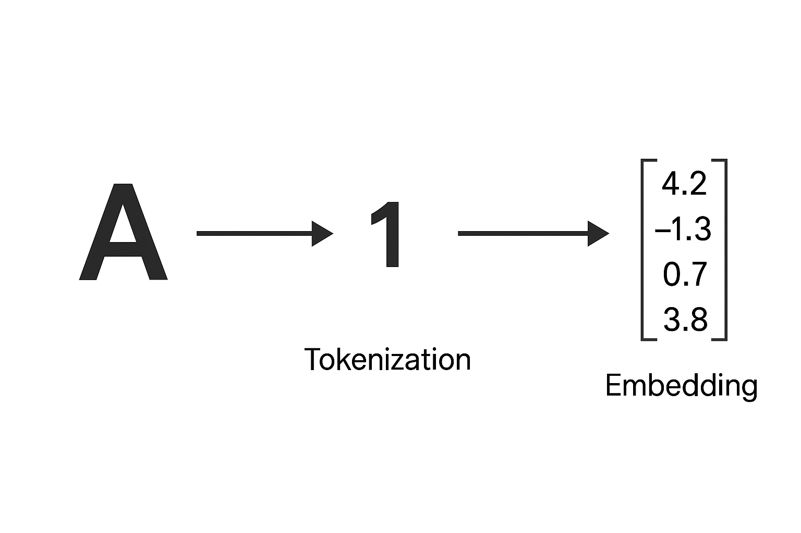

# An Introduction to Transformers in Biology

**Problem:**
Given an amino acid sequence, find a way to reliably predict the corresponding secondary structure sequence. 

**Biological Relevance**

Let's begin this discussion with the understanding that amino acids are the building blocks of proteins. One of the most fundamental laws of biology is that structure determines function. At the molecular and cellular level, the structure of proteins dictates their capabilities. Let's take hemoglobin for example. Hemoglobin is an oxygen distributing protein complex that is essential to human life. Hemoglobin's ability to distribute oxygen is thanks to its structure. Its structure is a consequence of the arrangement of amino acids that were used to build the protein. In this project we are zooming into protein structure and looking at what biologists call the secondary structure. Secondary structures are constructed with regards to how local amino acids interact with each other. A few examples include helical, coil, and sheet like structures. Together these secondary structures come together to build increasing levels of protein structure that eventually lead to the construction of the whole protein.


**Why Transformers?**

This problem requires us to understand the intricate relationships between individual amino acid residues and how they impact secondary structure. We are looking for patterns within a protein's amino acid sequence that gives us an improved chance of predicting the secondary structure. We are looking for a piece of software that can analyze sequences and pick out patterns. Thankfully, neural networks excel at tasks like this. A typical software program gives the computer a finite set of instructions. The greater variablility within the system, the harder it becomes to write a fitting program. To predict the behavior of complex systems like protein folding it is more efficient to use a neural network which has the flexibility of understanding systems with many variables.

**What are Transformers?**

In recent years there have been modifications and improvements upon the neural network architecture. The newest and most popular iteration is called the transformer. Most notablely it is the backbone of ChatGPT. For now think of the transformer as a machine that takes in information, finds patterns to understand the information, and lastly utilize the information to make a prediction.

**How Will We Use Transformers**

In order for transformers to pick up patterns and make valid predictions, they need to see many differnet pieces of information. In our case they need to look at a vast dataset of differing sequences to learn the patterns common between them all. We need a large dataset of varying residue sequences and their corresponding secondary structures. Training on such a dataset, will familiarize the transformer with various biological patterns. For example, the transformers will notice a specific string of residues tends to lead to a helical structure. Using that information it will adjust itself and apply that knowledge to make an improved prediction. The more data we allow the transformer to be trained on the better it should perform.

**Opening Up The Transformer**

The transformer needs to look at the full scope of a sequence to pick up a pattern. It's difficult to find a pattern when your scope is only a few residues wide. Transformers use a mechanism called ‘self-attention’ which allows them to observe all residues in a sequence at once. By constructing a full picture they can better define the context of each individual residue with respect to its surroundings. In a sequence like ABC, the C will provide a different context from a contrasting sequence like DEC. In biological terms, even though C is in the same position, its surrounding residues are different resulting in a different secondary structure sequence. Self-attention uses a full scope when trying to decipher how a single residue impacts secondary structure. 

**Finding Our Dataset**

When it comes to finding the right dataset we have two options. We can either create our own dataset using resources like the Protein Data Bank, an extensive library of all things protein, or we can download a curated one from Kaggle. Kaggle is a data science website that allows users to share datasets, competeing in machine learning competitions, and share projects.

To create a dataset using the Protein Data Bank (PDB) you will need to be mildly familiar with using python. If you are not comfortable doing so you can try using ChatGPT or other AI software to generate the information retrieval code for you. Disclaimer: code generated by AI can often harbor critical errors. While generating the code won’t be too complicated, debugging errors will require more technical expertise. The best thing you can do is learn what the generated code is actually executing so that you can debug errors when they appear. ChatGPT can give you templates of code but, it will be up to you to ensure that it completes the correct tasks. Those wanting to use the curated Kaggle dataset may skip the next section.

To create our own dataset there are two tools we will need to use. The first is the Protein Data Bank. This library houses all information related to any protein that has been discovered. The PDB labels all of its proteins with a four character identification tag called the PDB ID. The first step will be retrieving a list of PDB IDs that match the protein sequences we would like to have in our dataset. Some restrictions you may want to have in your dataset are: sequence length greater than 50 and less than 500, resolution requirements, and experimental method. Having a narrower range of sequences will better allow the transformer to pick up on patterns because the dataset is more normalized. A higher resolution and the experimental method used in discovery will ensure that the data retrieved is accurate. Next you will need to use this list of PDB IDs to retrieve the amino acid sequences. ChatGPT can generate a retrieval code or query that should return the list of PDB IDs along with their corresponding  sequences. Finally you will need to deploy the Define Secondary Structures of Protein (DSSP) algorithm to retrieve the secondary structures. DSSP uses the PDB ID given and parses through the protein's PDB file to construct a secondary structure sequence based on the protein’s 3D atomic coordinates. This should return a sequence that represents the protein’s secondary structure and that is the same length as the amino acid sequence. Each residue in the sequence is assigned a secondary structure indicator meaning a one to one correspondence is necessary. 

The second dataset option is using a curated one off Kaggle. Here is the dataset we are going to use as the standard in our project: Protein-Secondary-Structure. From here you will need to download the file and edit the file so that the data frame only contains the columns concerning amino acid sequences and secondary structure sequences.

**Feeding The Transformer**

Transformers require our inputs to be in a specific format in order to perform operations like self-attention. To understand the best format for our data, it is important to remember that all transformer operations are complex mathematical functions. Previously we have imagined that the transformer is fed an alphabetical sequence that represents amino acids and outputs a different alphabetical sequence that represents secondary structure. During training the transformer makes an initial prediction. The difference between its prediction and the expected value is called ‘loss’. Given enough repetitions in training, the transformer will minimize the loss and the difference between the prediction and the expected value will be negligible. In our imagination we can visualize the difference being the number of residues in the sequence wrongly labeled. In actuality, there is a real number that represents the loss. So how do we transform our alphabetical sequences into a format that allows the transformer to perform operations like self-attention and loss?

We prepare our data by mapping each possible character in our amino acid vocabulary to a number. There are 20 different amino acids that are commonly found in proteins. That means our vocabulary includes 20 unique characters, each representing an amino acid and each mapped to a unique number. Now our sequences are in a numerical format that programs can understand. In order for our transformer to understand and operate on them there is one last step called embedding. We map each number to a unique group of numbers. Remember how I said self-attention is able to determine the context of a single residue with respect to its surroundings. It is able to represent that context by changing the numbers in that residue’s group. That means that the more numbers in the group the more detailed a residue’s context can be. Think of the group of numbers like the resolution of a picture. The more pixels (higher resolution) means increased detail. This increase in the detail of the residue’s context is the entire reason why we represent each amino acid with a group of numbers instead of just one.

Review: take our sequence of letters, convert them into single/unique numbers, and then map these numbers to matrices. This process is done for the amino acid alphabet as well as the secondary structure alphabet. The following cells wil display how to process our data before training and evaluating the model. The process of mapping a character to a number is called tokenization and the mapping of the number to a group of numbers is called embedding. 



**Application**
When it comes time to use the transformer we can do so using python libraries like Hugging Face. Hugging Face is a library that contains a vast set of options when it comes to finding a specific model that meets your needs. We will access this library to import our transformer of choice. Another python library we will be accessing is PyTorch. Where Hugging Face provides us with models to use, PyTorch gives us the framework and tools we need to interact with the models.

**Preprocessing**

The first step is to import the dataset that we acquired through Kaggle. The orginal file contains a dataset with more columns than needed so we will be selecting and keeping the columbs containing the protein IDs, amino acid sequences, and corresponding secondary structure sequences.
```python
# Loading Kaggle SS file
import pandas as pd
from google.colab import drive

drive.mount('/content/drive')
file_path = '/content/drive/MyDrive/2018-06-06-pdb-intersect-pisces.csv.zip'
df = pd.read_csv(file_path)

#Filtering for 3 columns
new_df = df[['pdb_id','seq','sst8']]
new_df
```
The next cell filters our dataset so that it only contains sequences between 50-1000 residues. Limiting the variation in our dataset will make it easier for the transformer to handle the sequences.
```python
#Filtering for seq lengths inbetween 50-500
newer_df = new_df[new_df['seq'].str.len().between(51,999)]
newer_df
newer_df = newer_df.reset_index(drop = True)

#Saving to Drive
newer_df.to_parquet('/content/drive/MyDrive/kaggleDS')
```

The next step is tokenization or mapping our characters to numbers. To find all unique characters that may appear in our amino acid sequences, we concatenate all sequences and remove repeat characters. This leaves us with a list of characters representing our amino acid alphabet. From there we create a look up table that maps each letter in the alphabet to a unique number.
```python
#Loading curated Kaggle dataset
drive.mount('/content/drive')
file_path = '/content/drive/MyDrive/kaggleDS'
df = pd.read_parquet(file_path)

#Finding all unique letters in aa seq
unique_letters = set(''.join(df['seq'].to_list()))
unique_letters = '*ACDEFGHIKLMNPQRSTVWY'

#Creating dictionary to integer encode amino acids
character_to_indx = {character : indx for indx, character in enumerate(unique_letters)}
character_to_indx
```

The last step in tokenization is creating a pad token. If we want to train our model on multiple sequences at a time (to speed up the training process), we need to make sure that the sequences we are inputing are the same length. Padding applies a token on the end of the shorter sequences to match the length of the longest sequence during that training cycle. When transformers operate on the sequences they like symetry so leveling all sequences being inputed is vital. 
```python
#Creating a token just for padding
character_to_indx['<PAD>'] = len(character_to_indx)
pad_token = character_to_indx['<PAD>']
```

In this cell we are applying our mappings to the dataset in order to transformer them into lists of numbers. This cell also includes the same process for the secondary structure sequences.
```python
#Applying encoder to sequences
df['encoded_aa_seqs'] = df['seq'].apply(lambda seq: [character_to_indx[character] for character in seq])

#Finding all unique chacters in ss seq
unique_characters = set(''.join(df['sst8'].to_list()))
unique_characters = 'BCEGHIST'

#Creating dictionary to encode secondary structures
letter_to_indx = {character: indx for indx, character in enumerate(unique_characters)}
letter_to_indx

#Applying dictionary to ss seqs
df['encoded_ss_seqs'] = df['sst8'].apply(lambda seq: [letter_to_indx[letter] for letter in seq])

#Saving changes to drive
new_df = df
new_df.to_parquet('/content/drive/MyDrive/kaggleDS')
```


